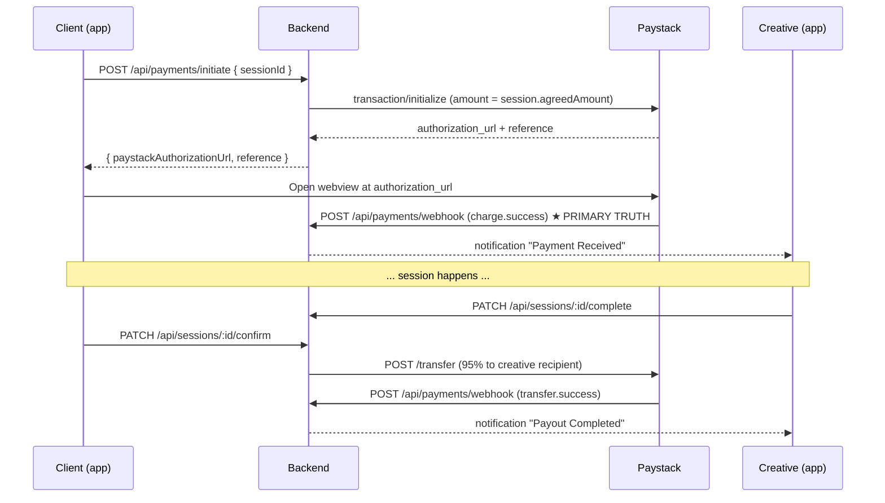
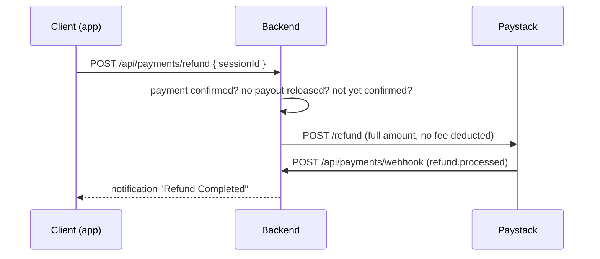

# Photobook Escrow Payments — Implementation Guide

> Paystack-powered escrow. The client pays the FULL amount → the funds sit in
> the platform's Paystack balance → once the work is accepted, the creative is
> transferred the amount **less a 5% platform fee**. If the requirements are
> not fulfilled, the client is refunded **100%** and the platform keeps nothing.

## The money model (read this first)

Paystack's native **Split Payment / subaccounts** feature is *not* escrow: it
splits at charge time and settles the subaccount on Paystack's normal payout
cycle, so the creative's share leaves your control immediately and cannot be
clawed back. Because we need to hold funds until the work is accepted, we
collect to the **platform balance** and then issue a **Transfer** for the
creative's 95%. Our 5% is simply the portion never transferred — the split is
recorded explicitly on the payout row (`gross_amount`, `platform_fee`,
`fee_rate`) so every naira reconciles.

The fee is rounded to the **nearest whole naira** and the creative receives the
**exact remainder**, so `platform_fee + amount === gross_amount` always.

| Agreed | Platform fee (5%) | Creative receives |
|--------|-------------------|-------------------|
| ₦50,000 | ₦2,500 | ₦47,500 |
| ₦1,050 | ₦53 | ₦997 |
| ₦333.33 | ₦17 | ₦316.33 |

---

## 1. Flow Overview



If the requirements are **not** fulfilled instead:



**Both** `complete` (creative) **and** `confirm` (client) are required before
any payout is released. Payout never happens for unpaid sessions.

**Auto-release.** A client who simply goes quiet must not strand the creative's
money. `complete` stamps `sessions.auto_release_at = NOW() + ESCROW_AUTO_RELEASE_DAYS`
(default 7). An hourly sweep (`src/services/escrow.job.js`) releases any session
past that deadline that was never confirmed, never refunded, and has no live
payout. The sweep checks the creative has a payout account **before** recording
the confirmation — confirming ends the client's refund window, so it never
happens unless the transfer can actually go out.

---

## 2. Environment Variables

| Variable | Required | Description |
|----------|----------|-------------|
| `PAYSTACK_SECRET_KEY` | ✅ | Server-side key. Use `sk_test_...` in dev, `sk_live_...` in prod. Never expose to the frontend. |
| `PAYSTACK_PUBLIC_KEY` | ✅ (frontend) | `pk_test_...` / `pk_live_...` — frontend initializes the Paystack widget/webview with this. |
| `PAYSTACK_CALLBACK_URL` | ✅ | `https://api.photobookhq.com/api/payments/verify` — Paystack redirects here with `?reference=xxx`. |
| `PAYSTACK_WEBHOOK_SECRET` | ❌ | **Leave unset.** Paystack signs webhooks with your *secret key* — it issues no separate webhook secret (that's Stripe). This var exists only as an explicit override. |
| `PAYSTACK_BASE_URL` | optional | Defaults to `https://api.paystack.co`. |
| `PAYSTACK_CURRENCY` | optional | Defaults to `NGN`. |
| `PAYSTACK_TIMEOUT_MS` | optional | Defaults to `20000`. Caps outbound Paystack calls. |
| `PLATFORM_FEE_RATE` | optional | Defaults to `0.05` (5%). Fee = round(amount × rate) to the whole naira; payout = amount − fee. |
| `ESCROW_AUTO_RELEASE_DAYS` | optional | Defaults to `7`. Days before unconfirmed deliverables auto-release. |
| `ESCROW_SWEEP_INTERVAL_MS` | optional | Defaults to `3600000` (hourly). |
| `CORS_ALLOWED_ORIGINS` | recommended | Comma-separated web origins. Unset = any origin allowed. |

> ⚠️ Webhook requests with an invalid signature are **rejected with 401**.
> Requests with a valid signature always get **200** (unknown events are
> ignored so Paystack doesn't retry them).

---

## 3. Endpoints

### 3.1 Initiate payment

```
POST /api/payments/initiate        (auth: client)
Body: { "sessionId": "<uuid>", "amount": 50000 }   // amount OPTIONAL
```

- The amount is **never trusted** — it must match `session.agreedAmount`
  (or be omitted entirely). Mismatch → `400`.
- Idempotent: the reference is deterministic per session
  (`pbb-p-<16 hex>`). Retrying after a failed attempt reuses the same
  reference — no duplicate Paystack transactions.
- `409 Payment already in progress` when a payment is `pending` or
  `confirmed` for that session.
- `400 Session has no agreed amount` when `agreed_amount` is NULL.

**Response**
```json
{
  "paystackAuthorizationUrl": "https://checkout.paystack.com/...",
  "reference": "pbb-p-0000000000000000"
}
```

### 3.2 Verify payment (redirect fallback)

```
GET /api/payments/verify/:reference   (auth)
GET /api/payments/verify?reference=   (auth)  ← Paystack redirect target
```

**Response**
```json
{ "status": "confirmed", "sessionId": "<uuid>", "amountPaid": 50000, "reference": "pbb-p-..." }
```

### 3.3 Webhook (PRIMARY truth source)

```
POST /api/payments/webhook            (no auth — HMAC signature)
```

Events handled:

| Event | Effect |
|-------|--------|
| `charge.success` | Payment → `confirmed`, notifications to client + creative |
| `transfer.success` | Payout → `completed`, notification to creative |
| `transfer.failed` / `transfer.reversed` | Payout → `failed`, creative notified |
| `refund.pending` / `refund.processing` | Refund → `processing` |
| `refund.processed` | Refund → `completed`, payment → `refunded`, session → `canceled`, client notified |
| `refund.failed` | Refund → `failed`, payment back to `confirmed` so it can be retried |

`charge.success` also verifies the amount Paystack actually collected against
the recorded amount — a short-paid charge never unlocks an escrow release.
Transfer webhooks match on `transfer_code`, falling back to our deterministic
`reference`, so a transfer whose HTTP response was lost still reconciles.

### 3.4 Bank accounts (creative payout destination)

```
GET    /api/payouts/banks                    → [{ code, name }] Nigerian banks
POST   /api/payouts/verify-account           → { accountName, accountNumber, bankCode }
POST   /api/payouts/bank-account             → save (creates Paystack recipient, encrypts number)
GET    /api/payouts/bank-account             → masked account info (404 when none)
DELETE /api/payouts/bank-account             → remove (also deletes Paystack recipient)
GET    /api/payouts/account/status           → readiness check, never 404s
GET    /api/payouts/quote?amount=50000       → fee breakdown before accepting a booking
```

Writing a payout account (`POST`/`DELETE /bank-account`) requires the
`photographer` role and is rate limited; only creatives receive payouts.

`GET /api/payouts/account/status` is what the payout-setup screen should call —
a creative with nothing saved gets a `200`, not a `404`:
```json
{
  "hasPayoutAccount": false,
  "canReceivePayouts": false,
  "platformFeePercent": 5,
  "account": null
}
```

`GET /api/payouts/quote?amount=50000`
```json
{ "grossAmount": 50000, "platformFee": 2500, "payoutAmount": 47500, "platformFeePercent": 5 }
```

`POST /api/payouts/bank-account`
```json
{ "accountNumber": "0123456789", "bankCode": "058", "accountName": "JADE SMITH" }
```
→ `accountName` is optional; it's auto-resolved via Paystack when omitted.

Saved account response (number is **never** returned in plaintext):
```json
{
  "message": "Bank account saved",
  "account": {
    "id": "<uuid>",
    "bankCode": "058",
    "bankName": "Guaranty Trust Bank",
    "accountName": "JADE SMITH",
    "accountNumberMasked": "******6789",
    "isVerified": true
  }
}
```

### 3.5 Session completion → payout

```
PATCH /api/sessions/:sessionId/complete    (auth: the session's creative)
PATCH /api/sessions/:sessionId/confirm     (auth: the session's client)
```

- `complete` sets status `completed` + `completed_at`.
- `confirm` sets `client_confirmed_at`.
- When both are set (in any order) and payment is `confirmed`, the payout
  fires automatically inside the same request. Response includes
  `{ payout: { status, amount, transferCode, createdAt } }` when released.

### 3.6 Payout status

```
GET /api/payouts/:sessionId    (auth: client or creative of the session)
```

```json
{
  "payout": {
    "sessionId": "<uuid>",
    "creativeId": "<uuid>",
    "amount": 47500,
    "grossAmount": 50000,
    "platformFee": 2500,
    "status": "processing",     // pending | processing | completed | failed
    "transferCode": "TRF-...",
    "createdAt": "2026-08-28T12:00:00.000Z",
    "updatedAt": "2026-08-28T12:00:05.000Z"
  }
}
```

### 3.7 Refunds (full, no fee)

```
POST /api/payments/refund            (auth: the session's client or creative)
Body: { "sessionId": "<uuid>", "reason": "optional" }

GET  /api/payments/refund/:sessionId (auth: involved parties)
```

The platform takes **no fee on a refund** — the client gets 100% back. A refund
is only possible while the money is genuinely still held:

| Condition | Result |
|-----------|--------|
| Payment not `confirmed` | `400 No confirmed payment to refund` |
| Payout `pending`/`processing`/`completed` | `409 Payout already in progress — the funds have left escrow` |
| Client already confirmed deliverables | `409 Deliverables already confirmed — this session can no longer be refunded` |
| A refund is already live | `409 Refund already in progress` |
| Caller not party to the session | `403` |

Refunds are **asynchronous**: the response is `202` with status `processing`,
and `refund.processed` finalizes it. Paystack typically returns card refunds in
3–5 business days (bank transfers can take longer).

**Automatic refund on decline.** If a creative declines a booking the client
already paid for, `PATCH /api/sessions/:id/decline` refunds in full
automatically and returns the refund on the response.

---

## 4. Frontend Integration Notes

1. **Initiate** → receive `paystackAuthorizationUrl` → open it in a
   webview/in-app browser (or use the Paystack JS SDK with
   `PAYSTACK_PUBLIC_KEY` + the returned `reference`).
2. **On webview close/redirect** (user lands on
   `PAYSTACK_CALLBACK_URL?reference=...`), call
   `GET /api/payments/verify?reference=...` and show the result.
   ⚠️ This is a **fallback** — the webhook may arrive later, so treat the
   webhook as truth and `verify` as a UI convenience.
3. **"Creative hasn't set up payout account" (400)** — when a payout can't
   fire, show the creative an in-app prompt linking to the bank account
   setup screen.
4. **409 Payment already in progress** — disable the pay button; the user
   already has a pending checkout for this session.
5. **502 Paystack errors** — show "Payment provider is unreachable, please
   retry" and keep the pay button enabled. Failed initializations are
   marked `failed` server-side so a retry reuses the same reference.
6. **Timeouts & retries** — `verify` can be polled up to 3 times at 3s
   intervals after webview close. If still not confirmed, rely on the
   webhook and in-app notifications (`payment_processed`) instead.

---

## 5. Testing Plan

| # | Scenario | Expected |
|---|----------|----------|
| 1 | Initiate with no session amount | `400 Session has no agreed amount` |
| 2 | Initiate with mismatched amount | `400 Amount does not match...` |
| 3 | Initiate twice in a row | 2nd → `409 Payment already in progress` |
| 4 | Non-client initiates | `403` |
| 5 | Webhook with bad signature | `401 Invalid webhook signature` |
| 6 | `charge.success` webhook | Payment `confirmed` + notifications |
| 7 | Creative completes before client confirms | Session completed, **no payout** yet |
| 8 | Client confirms before creative completes | Confirmed, **no payout** yet |
| 9 | Both complete + confirm, no bank account | `400 Creative hasn't set up payout account` |
| 10 | Both complete + confirm + account | Payout `processing`, `transferCode` returned |
| 11 | `transfer.success` webhook | Payout `completed` |
| 12 | Payout status by non-involved user | `403` |
| 13 | Refund a confirmed, unreleased payment | `202`, refund `processing` |
| 14 | Refund after the client confirmed | `409 already confirmed` |
| 15 | Refund after a payout was released | `409 funds have left escrow` |
| 16 | Refund an unpaid session | `400 No confirmed payment to refund` |
| 17 | Refund twice | 2nd → `409 Refund already in progress` |
| 18 | `refund.processed` webhook | Refund `completed`, payment `refunded`, session `canceled` |
| 19 | Creative declines a paid booking | Full refund fires automatically |
| 20 | Deliverables sent, client silent past the window | Escrow sweep auto-releases the payout |
| 21 | Auto-release with no payout account | Not confirmed, creative nudged, retried next sweep |

> Use Paystack **test mode** (`sk_test_...`) for everything. Unit tests:
> `npm test` (32 tests). `npm run test:payments` covers the fee split, kobo
> conversion, reference determinism, webhook signature verification and account
> masking; `npm run test:escrow` covers the refund eligibility state machine.

---

## 6. Security & Assumptions

- Account numbers are stored **AES-256-GCM encrypted** with
  `MESSAGE_ENCRYPTION_KEY` (same mechanism as message encryption).
- Amounts are validated server-side against `session.agreed_amount`.
  Frontend amounts are ignored.
- Payout rows are UNIQUE per session; transfers reuse deterministic
  references so retries can't double-pay.
- Session rows are locked (`SELECT ... FOR UPDATE`) during payment
  initiation and payout triggering to prevent races.
- **Why not Paystack Split Payment:** native splits/subaccounts settle the
  creative's share on Paystack's own cycle, which defeats escrow — the money
  would be gone before the client accepts the work. We hold in the platform
  balance and transfer on release instead; the 5% fee is the un-transferred
  remainder, recorded explicitly on the payout row.
- **Refunds return 100%.** The platform fee only ever applies to a released
  payout, never to a refund.
- **Amounts are verified on the webhook**, not just at initiation — a
  short-paid `charge.success` is rejected with `amount_mismatch`.
- **Assumption:** one payment row per session (unique constraint). Retries
  reuse the same row and reference.
- **Manual fallback:** if a transfer webhook is missed, polling
  `GET /api/payouts/:sessionId` refreshes status from Paystack when the
  payout is non-terminal.
